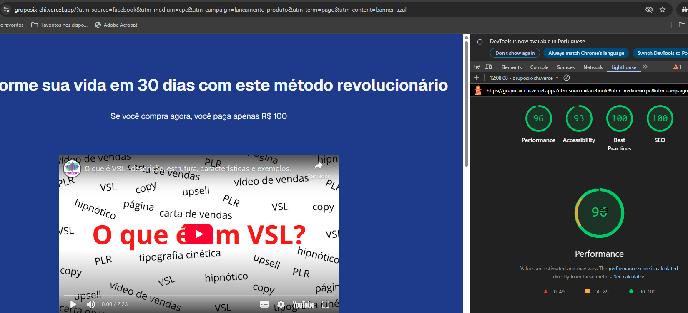

# Grupo Six - Maicon Borba

Projeto de vendas com sistema completo de rastreamento UTM e analytics.

## Tecnologias

- **Next.js 16** - Framework React moderno
- **TypeScript** - Tipagem segura
- **Material-UI v7** - Biblioteca de componentes
- **Tailwind CSS** - Estilização utilitária
- **Google Analytics** - Rastreamento e analytics

## Como Executar

### Desenvolvimento
```bash
npm run dev
```

## Configuração

1. Clone o repositório
2. Instale dependências: `npm install`
3. Configure as variáveis de ambiente em `.env.local`
4. Execute: `npm run dev`

## Resumo

- Para facilidade de manutenção, componentizei usando uma lógica parecida com Atômica (page > componente > elemento).

- Usei tailwind css para estilização mas prefiro scss modules, para estilizar em arquivos separados, melhorando a visualização do código.

- A página de checkout foi criada apenas com o intuito demostrativo para persistência de utms na navegação, visto que será um sistema de pagamento real, então ela mostra informacoes mockadas e os formulários não precisam ser preenchidos para finalizar a compra.

- Criei um tema para o sistema de cores, para facilitar a manutenção e a consistência visual.

- Criei um hook para capturar os parâmetros UTM e persisti-los durante a navegação do usuário, garantindo que os parâmetros de marketing sejam mantidos em todos os links de checkout, com persistência no localStorage, para que possam ser recuperados em caso de perda durante paginação.

- Também criei um componente para o GA, para que possa ser facilmente integrado em qualquer página da aplicação. Assim podemos fazer integração com o GA em qualquer página da aplicação, e termos redundância dos parâmetros UTM.

- Fiz um sistema de variáveis de ambiente cobrindo: Link da VSL, Links de checkout, Ticket médio, ID do GA: 
    - O link da Vturb tem um funcionamento diferente do que fiz aqui para o link do youtube;
    - A lógica para lidar com os links de checkout precisaram de uma adaptação, visto que fiz um mock da página de checkout;
    - O valor do ticket médio coloquei para anúncio do produto, mas ele deve estar alinhado com o valor de cada produto;
    - O copy (conteúdo/textos) da página deixei em um arquivo json separado, para facilitar a manutenção, internacionalização e lateralidade da criação de novas páginas
    - ID do GA já aparece nas request como collect?v=...G=XXXX

A idéia desse sistema de variáveis de ambiente é que possamos facilmente mudar os valores de cada variável sem precisar mudar o código, diretamente na Vercel, ganhando agilidade e diminuindo a chance de erros.


## Estrutura do Projeto

```
src/
├── app/
│   ├── components/           # Componentes reutilizáveis
│   │   ├── ProductsCard.tsx     # Cards de produtos com UTM
│   │   ├── TestimonialCard.tsx  # Cards de depoimentos
│   │   ├── CtaButton.tsx        # Botões de CTA
│   │   ├── UTMCapture.tsx        # Captura de UTMs
│   │   └── GoogleAnalytics.tsx # GA integration
│   ├── hooks/               # Hooks personalizados
│   │   └── useUTM.ts          # Sistema de persistência UTM
│   ├── sections/            # Seções da página
│   │   ├── SectionHeadline.tsx
│   │   ├── SectionProducts.tsx
│   │   └── SectionTestimonials.tsx
│   ├── utils/               # Utilitários
│   │   └── getThemeClasses.tsx   # Sistema de temas
│   ├── content/             # Conteúdo estático
│   ├── layout.tsx           # Layout principal com GA
│   ├── globals.css           # Estilos globais e temas
│   ├── page.tsx             # Página principal
│   ├── checkout-page/       # Página de checkout
│   └── pagina-de-obrigado/ # Página de confirmação
├── public/                # Assets estáticos
├── .env.local             # Variáveis de ambiente
└── package.json           # Dependências
```

## Funcionalidades Implementadas

### Sistema UTM
- **Captura automática** de parâmetros da URL
- **Persistência** em localStorage
- **Propagação** para todos os links de checkout
- **Integração** com Google Analytics

### Interface Responsiva
- **Design mobile-first** com breakpoints
- **Stepper customizado** para checkout mobile
- **Cards responsivos** com hover effects

### Sistema de Temas
- **Cores personalizadas** (primary, secondary, tertiary, quaternary)
- **Classes utilitárias** CSS
- **Consistência visual** em toda aplicação

### Componentes
- **ProductsCard** com fundo azul escuro e borda azul
- **TestimonialCard** com estilo unificado
- **CtaButton** com UTMs integrados
- **SectionHeadline** responsiva

## Paleta de Cores

### Primary (Azul)
- **50:** `#eff6ff` (Muito claro)
- **100:** `#f8fafc` (Claro)
- **500:** `#3b82f6` (Principal)
- **900:** `#1e3a8a` (Muito escuro)

### Secondary (Laranja)
- **100:** `#eff6ff` (Claro)
- **500:** `#f97316` (Principal)

### Tertiary (Roxo)
- **500:** `#818cf8` (Principal)

### Quaternary (Rosa)
- **500:** `#8b5cf6` (Principal)


## Analytics

O projeto inclui rastreamento completo:
- **Page views** automáticas
- **Eventos UTM** personalizados
- **Conversões** rastreadas
- **Funil de vendas** analisável


## Lighthouse




---
